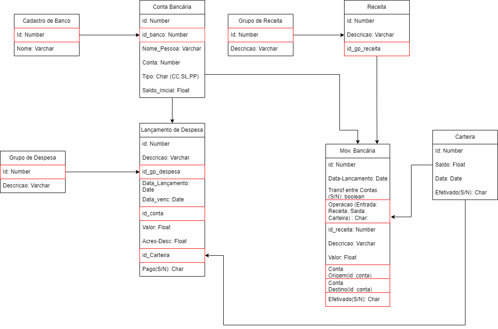

# Projeto Integrador CPF

## *CPF - Controle Pessoal de Finanças*!  
O projeto tem como finalidade criar um sistema de controle financeiro para pessoas que estão endividadas, para que possam organizar suas finanças e ter o controle de suas dívidas.

Nosso projeto será uma aplicão em React;

O sistema conterá as seguintes tabelas:  
* Movimentação Bancária  
* Lançamento de Despesas.  
* Pagamento de Contas.  
* Gráficos e relatórios. 

### *MER*

Autores:  
José Pires.  
